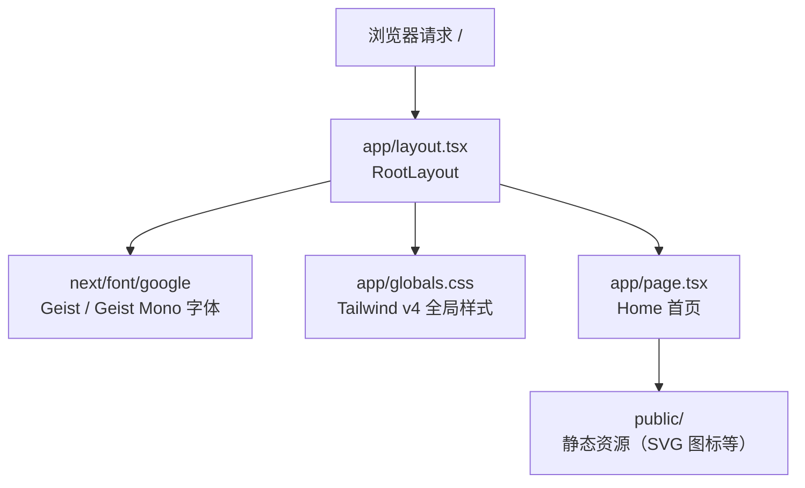

<div align="center">

# Next.js 应用

**基于 create-next-app 起步的现代化全栈起点 —— Next.js 16 · React 19 · TypeScript · Tailwind CSS 4**

[](https://nextjs.org)
[](https://www.typescriptlang.org)
[](LICENSE)
[](https://github.com/JingHao-Leon/nextjs/commits/main)
[](https://github.com/JingHao-Leon/nextjs)

[](https://nextjs-kohl-six-87.vercel.app)

</div>

---

一个干净的 Next.js 16 起步工程：App Router 架构、React 19、Tailwind CSS v4、ESLint 9 flat config 全部预置完毕，`npm run dev` 即可开始开发。适合作为新项目的模板基座。

## ✨ 技术栈亮点

<table>
<tr>
<td width="50%">

### ⚡ Next.js 16 + App Router
最新的 App Router 目录约定（`app/`），根布局 `layout.tsx` 包裹页面 `page.tsx`，服务端组件默认可用。

</td>
<td width="50%">

### ⚛️ React 19 + TypeScript 5
React 19.2 搭配完整的类型支持（`@types/react` / `@types/node`），`strict` 模式的 `tsconfig.json` 开箱即用。

</td>
</tr>
<tr>
<td width="50%">

### 🎨 Tailwind CSS v4
新一代 CSS-first 配置方式：`globals.css` 里通过 `@import "tailwindcss"` 与 `@theme` 定义主题变量，内置深色模式（`prefers-color-scheme`）。

</td>
<td width="50%">

### 🔤 Geist 字体与规范工具链
通过 `next/font` 自动优化加载 Vercel 的 Geist / Geist Mono 字体；ESLint 9 flat config 集成 `core-web-vitals` 与 TypeScript 规则。

</td>
</tr>
</table>

## 🧱 应用结构



## 🚀 快速上手

环境要求：Node.js 18.18+（Next.js 16 要求）。

```bash
# 安装依赖
npm install

# 启动开发服务器（默认 http://localhost:3000）
npm run dev

# 生产构建
npm run build

# 启动生产服务器
npm run start

# 代码检查
npm run lint
```

启动后编辑 `app/page.tsx`，页面会自动热更新。

## 📁 目录结构

```
├── app/
│   ├── layout.tsx          # 根布局：注入 Geist 字体与全局样式
│   ├── page.tsx            # 首页组件
│   ├── globals.css         # Tailwind v4 主题变量与全局样式
│   └── favicon.ico
├── public/                 # 静态资源（next / vercel / globe 等 SVG）
├── next.config.ts          # Next.js 配置（当前为默认空配置）
├── eslint.config.mjs       # ESLint 9 flat config（core-web-vitals + TS）
├── postcss.config.mjs      # PostCSS 接入 @tailwindcss/postcss
├── tsconfig.json           # TypeScript 配置（strict）
└── package.json
```

## ⚙️ 配置要点

- **样式**：Tailwind CSS v4 采用 CSS-first 配置，主题变量定义在 `app/globals.css` 的 `@theme` 块中，无需 `tailwind.config.js`。
- **字体**：`app/layout.tsx` 中通过 `next/font/google` 加载 Geist / Geist Mono，构建时自动优化，无布局偏移。
- **Lint**：ESLint 使用新版 flat config（`eslint.config.mjs`），已忽略 `.next/`、`out/`、`build/` 等产物目录。
- **部署**：已部署至 [Vercel](https://nextjs-kohl-six-87.vercel.app)；推送后可直接通过 Vercel 导入仓库实现持续部署。

## 🗺️ 现状与 Roadmap

本项目目前是 **create-next-app 的初始脚手架**，尚未包含业务功能。后续计划：

- [ ] 添加业务页面与 API 路由（`app/api/`）
- [ ] 引入数据层与状态管理
- [ ] 补充测试（单元 / E2E）
- [ ] 自定义首页内容，替换默认模板页

---

<div align="center">
<sub>
基于 <a href="https://nextjs.org/docs/app/api-reference/cli/create-next-app">create-next-app</a> 构建 ｜ 在线预览：<a href="https://nextjs-kohl-six-87.vercel.app">nextjs-kohl-six-87.vercel.app</a>
</sub>
</div>
